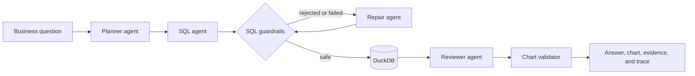

# DataPilot — Agentic Data Analyst

DataPilot is an agentic analytics application that turns plain-English business questions into safe, inspectable analysis over uploaded CSV and Parquet files. It plans the analysis, generates and repairs DuckDB SQL, validates every query, executes it locally, and presents an evidence-backed answer with an automatically selected chart.

Built as a portfolio project for data analyst and data engineering roles.

## Highlights

- Upload one or more related CSV or Parquet tables.
- Ask business questions without writing SQL.
- Inspect the analysis plan, assumptions, executed SQL, result data, and workflow trace.
- Generate bar, line, and scatter charts with deterministic validation.
- Repair failed SQL automatically using execution feedback.
- Keep query execution local while sending only schema context and sample rows to Groq.
- Enforce SELECT-only SQL, known-table access, a 500-row result cap, and blocked external file functions.

## How it works



1. The planner checks whether the question is answerable from the uploaded schema and defines the metric, dimensions, filters, and assumptions.
2. The SQL agent produces a DuckDB query using only known tables and columns.
3. SQLGlot guardrails reject writes, multiple statements, unknown tables, and external file access.
4. DuckDB executes the validated query locally. Execution errors are returned to the repair agent for up to three attempts.
5. The reviewer summarizes only the returned evidence and recommends a visualization.
6. A deterministic chart validator checks the selected fields and safely falls back to an appropriate bar, line, or scatter chart.

## Technology

| Area | Tools |
| --- | --- |
| Interface | Streamlit |
| Agent workflow | Python, typed Pydantic contracts |
| LLM | Groq using an OpenAI-compatible client |
| Query engine | DuckDB |
| SQL safety | SQLGlot AST validation |
| Data handling | Pandas, CSV, Parquet |
| Quality | Pytest, Ruff, reproducible evaluations |

## Quick start

### Prerequisites

- Python 3.11 or newer
- A free [Groq API key](https://console.groq.com/keys)

### Installation

```powershell
git clone https://github.com/AaditHire/Data-Pilot.git
cd Data-Pilot
python -m venv .venv
.venv\Scripts\Activate.ps1
pip install -e ".[dev]"
```

Save the API key through the included secure-input script. The key is written to the ignored `.env.local` file and is never printed:

```powershell
.\scripts\save_groq_key.ps1
```

Start the application:

```powershell
streamlit run app.py
```

Open `http://localhost:8501`, upload one or more datasets, preview the loaded tables, and ask a question using their fields.

## Example questions

The app creates dataset-specific suggestions after upload. Questions can include:

- “Compare average price by city.”
- “Show monthly revenue and identify the strongest month.”
- “How strongly are area and price related?”
- “Which customer segment has the highest average order value?”

## Safety and privacy

- `.env.local`, `.env`, Streamlit secrets, virtual environments, uploads, and evaluation outputs are excluded by `.gitignore`.
- API keys are loaded from environment configuration and are never hard-coded.
- SQL is parsed before execution and must be a single read-only query.
- Queries can reference only tables loaded into the current workspace.
- DuckDB runs locally and cannot use external file-reading functions through generated SQL.
- Only schema information and up to three sample rows per table are included in model context.

Use synthetic or non-sensitive datasets when demonstrating the public portfolio application.

## Tests and evaluations

The deterministic unit tests do not call an LLM:

```powershell
pytest -q
```

Run linting with:

```powershell
ruff check .
```

The end-to-end evaluation suite makes Groq API calls and stores its output locally:

```powershell
python evals/run_evals.py
```

The evaluation cases measure task success, SQL repair behavior, latency, and answer quality across reproducible business questions.

## Project structure

```text
app.py                         Streamlit application
.streamlit/config.toml         Application theme
src/datapilot/agent.py         Planner, SQL, repair, reviewer workflow
src/datapilot/charts.py        Chart validation and fallback selection
src/datapilot/guardrails.py    Read-only SQL safety policy
src/datapilot/workspace.py     DuckDB workspace and data tools
src/datapilot/models.py        Typed workflow contracts and traces
src/datapilot/sample_data.py   Reproducible synthetic evaluation data
scripts/save_groq_key.ps1      Hidden API-key setup
evals/                         End-to-end benchmark cases
tests/                         Deterministic unit tests
```

## Resume bullet

> Built an agentic data analyst using Python, Groq, DuckDB, SQLGlot, Streamlit, and Pydantic that plans business analyses, generates and repairs read-only SQL, validates chart recommendations, and produces evidence-backed visualizations across uploaded CSV and Parquet datasets.

## Roadmap

- Add PostgreSQL and dbt semantic-layer connectors.
- Add query-cost estimation and per-session token budgets.
- Export analysis results and charts.
- Add explicit follow-up-question memory.
- Expand the benchmark with ambiguous and adversarial questions.
- Containerize and deploy the application.
